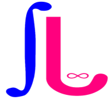
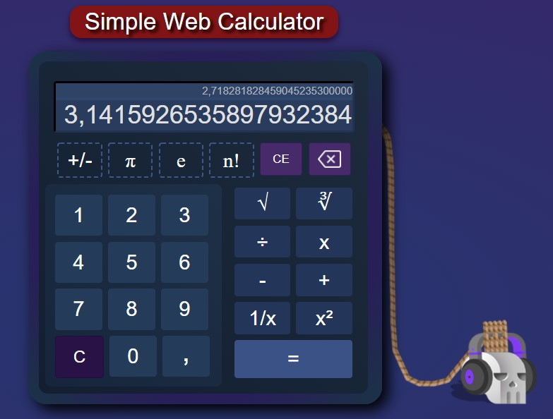
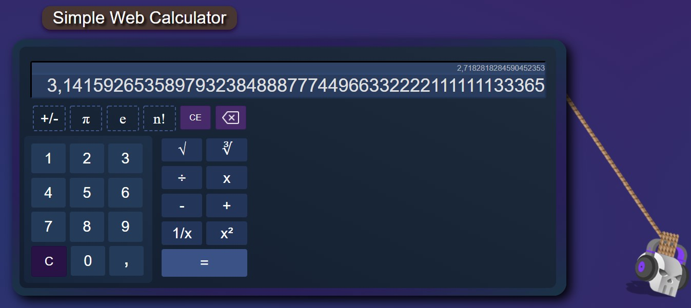

# Calculators

### The "Calculators" is a basic tool that has the system of a normal arithmetic calculator, with the specialty of having some buttons and scientific symbols.

#### This is a simple arithmetic web calculator, with some implementations of a scientific one, made only with HTML, CSS and JavaScript.

## Technologies used in the program

- [HTML5](https://developer.mozilla.org/en-US/docs/Web/HTML)
- [CSS3](https://www.w3.org/Style/CSS/Overview.en.html)
- [JavaScript](https://www.javascript.com/)

## Contributions

Pull requests are welcome. So if you've got an idea of how to improve this code, I'll thank you for opening an issue to check that change that you want to make.

## Icon Design Credits

## License

#### MIT © [seanlab1](https://github.com/seanlab1)